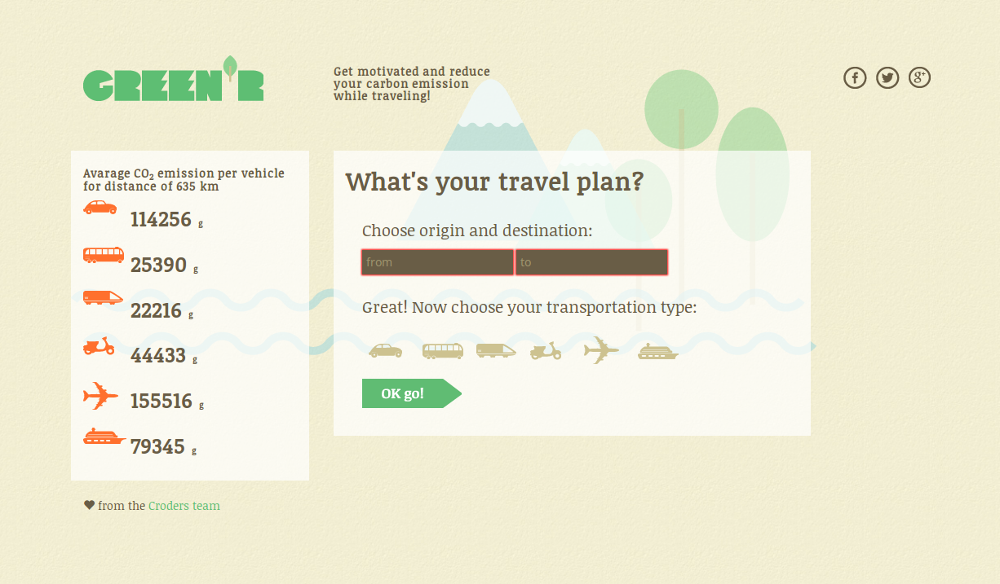
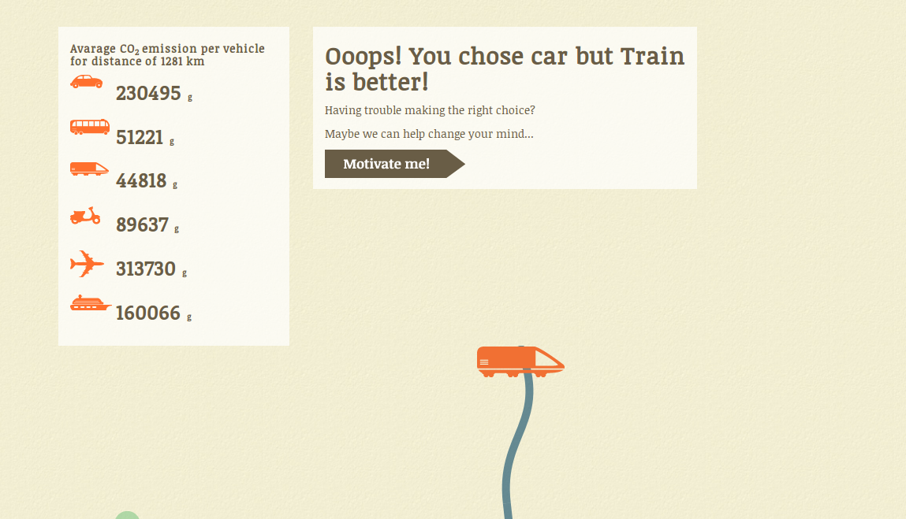
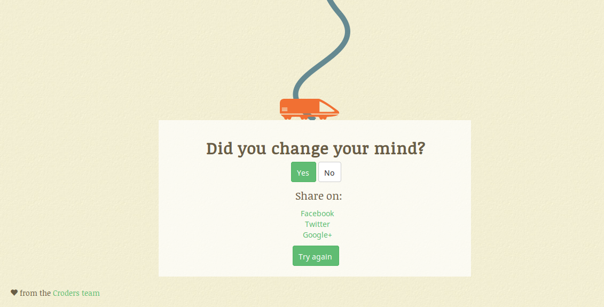
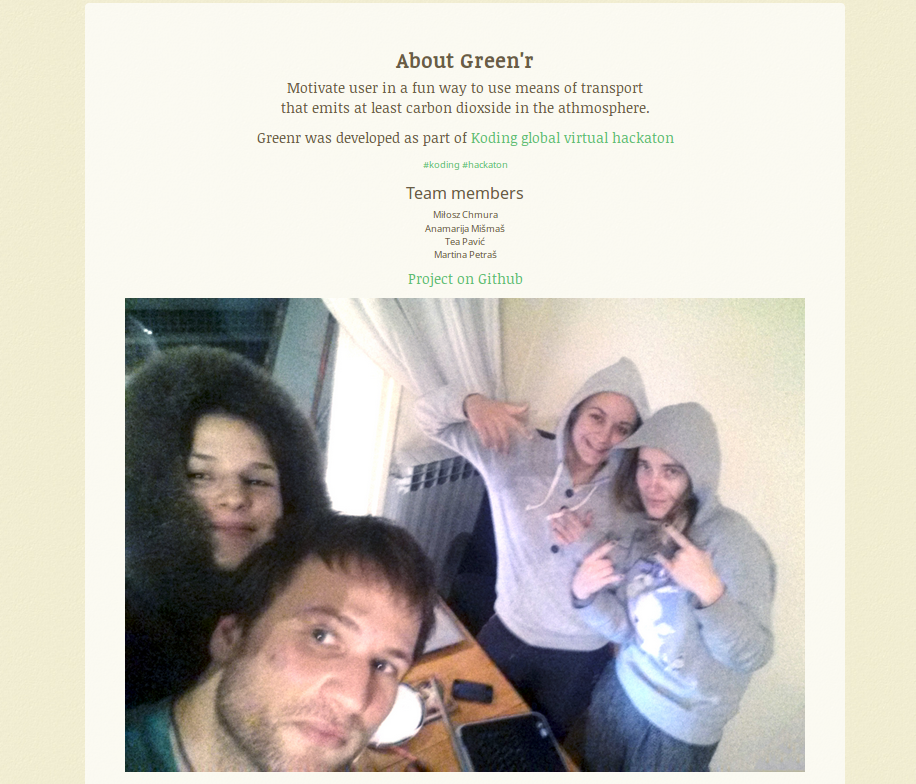

#Green'r

##Description
A web application that motivates the user to use the means of transport that emits the least amount of CO2. 
It does so by presenting statistically positive outcomes, based on the calculated reduction of CO2 emission
should the user choose the suggested means of transport for his travel (for example amount of gas saved, direct
impact on the environment etc).

###Demo

[Demo page](http://greenr.listup.co/)

###Product goals

1. educating the user about his role in environmental pollution
2. encouraging users to use more ecologically acceptable means of transport when possible

###Functionalities

- displaying information about the effects of CO2
- displaying CO2 emission relative to each featured vehicle per kilometer
- calculating CO2 emission depending on the selected means of transport and calculated distance from point A to B
user feedback
- fetching random information about impact of carbon dioxide emissions on environment from freebase
- share option for social networks

##Screenshots

##APIs used
- freebase
- google places
- commutegreenerinfo
